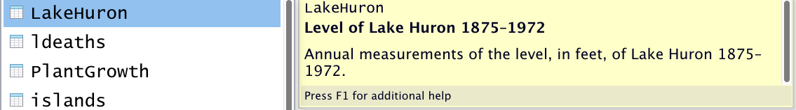

This module motivates the use of R and describes some preliminary concepts and steps before we begin with the sessions on data wrangling and visualization.

# What is R?

According to the R [website](https://www.r-project.org/), R is "a free software environment for statistical computing and graphics." Its hashtag on Twitter is #RStats, but, as some have [alluded to](https://mobile.twitter.com/WeAreRLadies/status/1541914841199149057), R can do much more than statistics. For example, it can [make maps](https://r-spatial.github.io/mapview/), [create websites](https://bookdown.org/yihui/rmarkdown/), and, importantly, [manipulate data](https://dplyr.tidyverse.org/).

Aside: I don't view the manipulation and analysis of data (creating variables, counting things, putting things in groups, etc.) as necessarily within the realm of statistics, unless I intend to infer the results of that analysis to a larger or separate population.

[Definitions of statistics](https://www.yourdictionary.com/statistics) aside, the point is that R is a programming language that allows you to perform most any data-manipulation, data-analysis, or data-visualization task (including statistics)!

# Why R?

Why should we use R for manipulating and analyzing data?

## R vs point-and-click data-analysis tools like Excel and ArcGIS

This [post](https://www.jessesadler.com/post/excel-vs-r/) by Jesse Adler (a digital historian) is a well-written overview of the advantages of using a programming language like R to manipulate and analyze data rather than spreadsheet tools like Excel. Summarizing their post with [another](https://www.dataquest.io/blog/9-reasons-excel-users-should-consider-learning-programming/) on the topic, here are my top four advantages of programming:

-   **Every step is written down**, so it's easier to find and fix errors.

-   **Easier to repeat analysis steps**: suppose you realize you want to make a change upstream in your analysis that affects everything downstream of it. In R, this is straightforward: simply make the change, and rerun all of the code that relies upon it (and possibly make some changes to the downstream code to accommodate that change as needed). In a point-and-click interface like Excel or ArcGIS, you may have to repeat several point-and-click steps, which would take longer and be more susceptible to error.

-   There is a **clear division between data entry and data manipulation and analysis**: it's easier to avoid the temptation of editing the raw data. Although you can certainly make a copy of raw data in Excel (e.g., copy to new sheet), it can be tempting to edit the raw data.

-   **Easier to automate similar tasks**. Frequently in data analysis, we'd like to repeat very similar steps, maybe just by changing one element. The ability to automate similar steps becomes especially important for bootstrapping where we effectively repeat the analysis hundreds of time while allowing some of the steps to randomly vary. This would be much more challenging in Excel.

To be clear, I think Excel is great, too. I use it often for simple analyses or for data entry. But I don't use it as much as I once did for more involved analyses.

## Why R vs SAS, STATA, and Python?

Okay, but there are other programming tools for data analysis (e.g., SAS, STATA, Python). Why R, specifically?

1.  It's free. SAS and STATA cost money.
2.  It has an active, helpful, and friendly user community. Googling a topic along with "R" often leads to useful public discussion on forums like [stackoverflow](https://stackoverflow.com/questions/tagged/r) or [RStudio community](https://community.rstudio.com/).
3.  It can manipulate spatial data and make maps. No need to switch software for GIS. In an analysis with a spatial component, this is **very** important.
4.  As noted above, R can do a lot of cool stuff. For example, with RMarkdown, you can make websites like this [one](https://michaeldgarber.github.io/), create [interactive dashboards](https://rmarkdown.rstudio.com/gallery.html), and do lots more amazing [talk](https://www.youtube.com/watch?v=qLEkUjxk7e8) by RMarkdown creator).
5.  For some of the reasons above, having used SAS for years, I personally think R is simply more fun.

I know many people use and like Python, which is also free and shares many of R's advantages. I don't have much Python experience, so I can't really comment on it. Every now and then, I encounter a situation where I wish I had some Python skills (e.g., to use this [package](https://github.com/gboeing/osmnx) to compute measures on street networks from OpenStreetMap), but those situations are rare.

# Install R and RStudio and become familiar with the user interface.

Let's get up and running with R now.

1.  **Install R and RStudio.** R can be used as a stand-alone program, but RStudio (an [IDE](https://en.wikipedia.org/wiki/Integrated_development_environment)) adds several helpful features that make coding in R easier.

-   To download R, go to CRAN and download R from the location nearest you: <https://cran.r-project.org/mirrors.html>.
-   Then, install RStudio Desktop (the free version) at this link: <https://rstudio.com/products/rstudio/download> .

The [Appendix](https://rstudio-education.github.io/hopr/starting.html#how-to-download-and-install-r) of this free online book, [Hands-On Programming with R](https://rstudio-education.github.io/hopr/), by Garrett Grolemund, describes the installation process in more detail.

2.  **Familiarize yourself with the RStudio interface.** There are a few ways to write code in R, including:

-   **Using a [script](https://rstudio-education.github.io/hopr/basics.html#scripts)**. I almost always write code using a script, which is essentially a special text file that can be saved and edited as you would a Word document.

-   **Using [RMarkdown](https://bookdown.org/yihui/rmarkdown/)** is another option. I made this web page using RMarkdown. It allows the author to include narrative text, code, and the code's results in one streamlined document. RMarkdown is well-suited for something that will be presented (to someone besides yourself) and in my opinion is not the best choice for a typical data-analysis workflow, where I prefer scripts for their simplicity.

-   **Using the console**. Finally, if you just want to do a very basic task or calculation without creating a new file, you can type code in the console. I almost never use the console.

The book by Grolemund also provides an overview of [RStudio's user interface](https://rstudio-education.github.io/hopr/basics.html#the-r-user-interface).

Here's a screenshot of what the script window might look like:

{width="500"}

# Functions and packages

## Terminology

Two often-[quoted](https://adv-r.hadley.nz/functions.html) slogans describing R are that:

> "Everything that exists is an object."
>
> "Everything that happens is a function."
>
> \-[John Chambers](https://www.r-bloggers.com/2016/07/extending-r/).

So, at its core, when using R, you are using functions to perform actions on objects. (As we'll see explicitly when going over [purrr](https://purrr.tidyverse.org/), [functions are themselves objects](https://cran.r-project.org/doc/manuals/r-devel/R-lang.html#Function-objects) and can be manipulated by other functions.)

R comes pre-loaded with a set of functions that can be used to analyze data. This is called "base R" and is the foundation upon which everything else in R is built.

Many commonly used functions, however, are not a part of base R but are instead part of a [package](https://rstudio-education.github.io/hopr/packages2.html). Packages are collections of functions with related goals. They can also include data and documentation as part of the bundle. For example, [dplyr](https://dplyr.tidyverse.org/) is a package of functions with a common philosophy for manipulating data, and it includes some demo datasets.

## Install a package

Using a package requires first installing it with the `install.packages("package_name")` function and then loading it using the `library(package_name)` function. Note the absence of quotes inside the parentheses of the `library()` function. There is some stackoverflow [discussion](https://stackoverflow.com/questions/36802132/the-use-of-quotation-marks-when-loading-a-package-in-r) on whether to use quotes when loading packages. In my experience, it works better to *not* use quotes when loading packages but to use them when installing packages.

For this exercise, let's install the full **tidyverse**. The [tidyverse](https://www.tidyverse.org/) is a unique package in that it is a collection of packages, one of which is **dplyr**.

So here is our first code chunk to run:

```{r install tidyverse, eval=FALSE, echo=TRUE}
install.packages("tidyverse")
```

To run the code, put your cursor on that line or highlight that line of code, and then click the **Run** button above and to the right of the scripts window pane.


On Windows, the keyboard shortcut for **Run** is **control+enter**. On a Mac, it's **command+enter (return)**.

In my experience, it's usually fine to let R pick where it installs the packages on your computer. This may depend on whether you're using your own computer or, say, a work computer with limited access to certain drives. If needed, you can [specify](https://www.r-bloggers.com/2020/10/customizing-your-package-library-location/) where you want the package to land by adding the `lib= "file path"` argument in the `install.packages()` function. For example: `install.packages("tidyverse", lib = "file-path")`.

## Load the package

Now that the package is installed, load it using the `library()` function (no quotes). Loading the package tells R to make the functions of the package available for your current work session.

```{r load tidyverse, eval=TRUE, echo=TRUE, warning=FALSE, message=FALSE}
library(tidyverse)
```

# Here, here: a word on working directories and projects

## Here package and projects

The folder in which R reads (loads) and writes (saves) files is called the working directory. For years, I had set the working directory by typing the entire file path. This is not ideal practice for a few of reasons:

1.  It takes a long time to type a long file path.
2.  Typing file paths is prone to error. (How do I type the back-slash, \\ or /? Do I need the :?)
3.  It's hard-coded: If you were to change computers or share your code with someone, those working directories won't work.

Fortunately, there's a very simple solution to these issues: Use the [here](https://here.r-lib.org/) package. This package creates a working directory [relative]{.underline} to the location of the R project you are working in. This means that wherever your project is in the folder structure of your computer, the `here()` function to define your working directory and thus any read/write commands that rely on it will just work.

(Jenny Bryan's [ode](https://github.com/jennybc/here_here) to the here package is a great read.)

**What is a Project?** A [Project](https://support.rstudio.com/hc/en-us/articles/200526207-Using-RStudio-Projects) is an RStudio file associated with a working directory that facilitates organization of files (code, data, other documents) and particular settings relevant for one, well, project. For example, to create this course, I created a project called teach-r.


Note that all of folders in the same folder as the .Rproj file will conveniently appear in the "Files" tab.

It's worth giving some thought to the project's folder structure. There are no hard-and-fast rules, but I have taken [this advice](https://chrisvoncsefalvay.com/2018/08/09/structuring-r-projects/) and, minimally, create separate folders for code, input data that should never be modified, and processed data that is a result of code.

{width="500"}

You don't have to use projects to use R or RStudio, but I've [been convinced](https://www.tidyverse.org/blog/2017/12/workflow-vs-script/) that it's a good idea, in part because of how well projects pair with the **here** package.

## Example: change working directory using here()

```{r,eval=FALSE}
install.packages("here")
```

```{r }
library(here) #load package.
```

Note when you load the here package, it will by default tell you where your working directory is. We can also confirm this using the `getwd` base-R function.

```{r}
getwd() #base R
```

What if we want to change the working directory, to the "data-input" folder? Use the base-R `setwd()` function to set the working directory and the here function to define the path relative to the project. Note the "data-input" folder is one level beneath the .Rproj file (screenshot above).

```{r}
setwd(here("data-input"))
getwd() #check
```

Note if we wanted to set the working directory to another level beneath data-input, we would write: `setwd(here("data-input","another-level-beneath")`. That is, we would write the name of the sub-folder in quotes after a comma.

And if we want to change it back to the original directory containing the project? Simply use `here()` without specifying an argument.

```{r}
setwd(here())
getwd() #check
```

## Example: save a file to a working directory and a taste of dplyr

Okay, as mentioned, the tidyverse contains lots of packages. One of them is **datasets**, which includes, well, several datasets that can be used for demos like this one. I'm a Michigander, so let's grab the dataset on the water levels of Lake Huron from 1875 - 1972, make a few changes to it, and save it to a local folder.

{width="500"}

The below code chunk simply creates a copy of the LakeHuron dataset and calls it lake_huron_raw that is. In the next line of code, we print the object by typing its name.

Side-note: the `package_name::object` syntax, as in `datasets::LakeHuron`, is R's way of explicitly stating which package the object is coming from. We could have equally have written `lake_huron_raw = LakeHuron`, but sometimes it can be clearer to be explicit. And sometimes we *must* state the package name if the same word is used by multiple packages.

```{r}
lake_huron_raw = datasets::LakeHuron #Define new object called lake_huron_raw.

lake_huron_raw #Take a look at it.
```

That's hard to read. Let's clean it up and save it.

Don't sweat the dplyr code itself just yet (introduced next session), but, as an appetizer, we convert the dataset into an easier-to-work-with format ([a tibble](https://tibble.tidyverse.org/)) using `as_tibble()`, rename its one variable from `x` to `level_ft` using `rename()`, and create a new variable called `year` using `mutate()`, defined based on the row number (`row_number()` returns the row number). And we connect all these steps together using the [pipe operator](https://r4ds.had.co.nz/pipes.html) (`%>%`).

```{r}
lake_huron_transformed = lake_huron_raw %>% #use the object defined above
  as_tibble() %>% 
  rename(level_ft =x) %>% #rename variable to "level_ft"
  mutate(year = row_number()-1+1875) #add a column for year

lake_huron_transformed #look at the transformed data
```

Now we have an easier-to-comprehend dataset called `lake_huron` with two columns. I'd like to save it to the folder called "data-processed," which is one level beneath the project file. The [`save()`](https://www.rdocumentation.org/packages/base/versions/3.6.2/topics/save) function takes the object to be saved as its first argument and what it will be named on the computer as its second arguments. [A good](https://bookdown.org/ndphillips/YaRrr/rdata-files.html) (not the only) file format with which to save R objects locally is `.Rdata.`

```{r}
library(here)
setwd(here("data-processed"))
getwd() #check to confirm
save(lake_huron_transformed, file = "lake_huron_transformed.RData")
```

That concludes the background material. Now onto dplyr!
