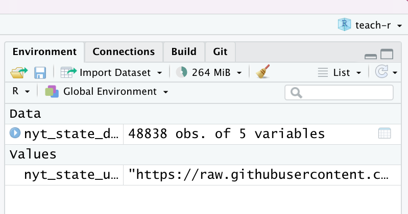

```{r "setup", include=FALSE, eval=TRUE, echo=FALSE}
require("knitr")
library(here)
```

# Outline

1.  Introduction and pre-requisites
2.  Install packages and download the data
3.  Explore the NYT state COVID-19 data using dplyr

# Introduction and pre-requisites

## Purpose

The purpose of this tutorial is to learn the basics of dplyr in the context of an applied example with publicly available COVID-19 data from The New York Times.

## Target audience

The target audience for this demo is someone with little to no experience using R. I will also assume no experience with any statistical programming language, although some experience with SAS or STATA would certainly not hurt. I imagine the target audience will have familiarity with the basics of data management in a spreadsheet-based program like Excel and may want to try using a programming-oriented tool for data management. For an excellent overview of why it can be preferable to analyze and manage data with a programming language rather than spreadsheet tools, please see the preliminary module of this series (<https://michaeldgarber.github.io/teach-r/0-pre-reqs>) or this great [blog post](https://www.jessesadler.com/post/excel-vs-r/) by Jesse Adler.

## What is dplyr?

[Dplyr](https://dplyr.tidyverse.org/) is a set of functions for managing and manipulating data in R. As stated on the webpage:

> "dplyr is a grammar of data manipulation, providing a consistent set of verbs that help you solve the most common data manipulation challenges."

There are several ways to manage data in R, including [base R](https://stat.ethz.ch/R-manual/R-devel/library/base/html/00Index.html). I focus here on dplyr because it's widely used and, I think, intuitive. Dplyr is part of the larger collection of packages called the [tidyverse](https://www.tidyverse.org/), which includes other popular packages like ggplot2. One advantage of dplyr is that, when combined with the pipe operator (explained below), it is quite human readable. Like good writing , it emphasizes the verbs (Zinsser, On Writing Well, Chapter 10).

## The goal of this tutorial

The goal of this tutorial is to illustrate the basics of dplyr using publicly available data on COVID-19 incidence posted by [The New York Times](https://github.com/nytimes/covid-19-data).

## Prerequisites

1.  R and RStudio are installed.

As a [reminder](https://michaeldgarber.github.io/teach-r/0-pre-reqs):

-   To download R, go to CRAN and download R from the location nearest you: <https://cran.r-project.org/mirrors.html>.
-   Then, install RStudio Desktop (the free version) at this link: <https://rstudio.com/products/rstudio/download> .

2.  You're familiar with how to use the RStudio interface

```{r, echo=FALSE}
library(here)
knitr::include_graphics(here("docs", "images", "script-screenshot.png"))
```

3.  **Explore resources on dplyr.** Finally, although we'll cover the basics of *dplyr* here, you might peruse some of the excellent existing material on dplyr:

-   <https://dplyr.tidyverse.org/> - The main webpage contains a short overview of the package and describes the key functions, aka verbs, as we will also do here.
-   <https://dplyr.tidyverse.org/articles/dplyr.html> - The vignette expands upon the main landing page with some examples.
-   <https://r4ds.had.co.nz/transform.html> - This [book](https://r4ds.had.co.nz/) by Wickham and Grolemund is the authoritative guide to learning the tidyverse. The chapter on [data transformation](https://r4ds.had.co.nz/transform.html) chapter covers dplyr, specifically.

# Install packages and download the data

## Install and load packages

Now that we have RStudio installed and up and running, our first step is to install packages, the basics of which we described in the [previous module](https://michaeldgarber.github.io/teach-r/0-pre-reqs).

```{r, eval=FALSE, echo=TRUE}
install.packages("tidyverse")
```

```{r}
library(tidyverse)
```

## Load the COVID-19 data from *The New York Times*

For this example, we will use COVID-19 data from [The New York Times' GitHub repository](https://github.com/nytimes/covid-19-data). There are a few datasets available at varying geographic scales. Let's use their state-level dataset. The data include the number of cumulative cases and the number of cumulative deaths by state and day, beginning January 21, 2020.

We'll load the data two ways, hoping at least one of them works.

### Load the data directly from their Github repository

First, let's try the fancy way, loading it directly from GitHub. Below, the first line of code defines an object, `nyt_state_url` to be the URL where the NYT data are located. The second line of code uses a base R function, `url()`, to parse that URL as a CSV. We then convert it from a CSV to an R object using `read_csv()`. `read_csv()` is a function in *readr*, another package in the **tidyverse.** Accordingly, the resulting output of these few lines of code will be a [**tibble**](https://r4ds.had.co.nz/tibbles.html), tidyverse speak for a "tidy table." Basically, a tibble is a table, or data frame, with some opinionated formatting advantages that make it easy to work with.

Of note, the code below includes our first use of the `%>%` (read: [pipe](https://magrittr.tidyverse.org/reference/pipe.html); keyboard shortcut: cmd+shift+m on Mac; ctrl+shift+m on PC) operator. The pipe operator is part of the **magrittr** package and is a key element of the tidyverse. The pipe separates the action-oriented functions, `read_csv()` and `url()` from the object, `nyt_state_url`. I think this separation makes the code easier to read, as I'll discuss more in the next section.

Another side-note: I use the equals sign, `=`, when assigning new objects, because I think it's easier to read type than R's [traditional assignment operator](https://stat.ethz.ch/R-manual/R-devel/library/base/html/assignOps.html), `<-`. I've heard `<-` has advantages, but I've never had an issue using `=`.

```{r load NYT data, eval=TRUE, echo=TRUE, warning=FALSE, message=TRUE, cache=TRUE}
nyt_state_url = "https://raw.githubusercontent.com/nytimes/covid-19-data/master/us-states.csv"

nyt_state_data = nyt_state_url %>% 
  base::url() %>% 
  readr::read_csv() 
```

An alternative, equivalent, way to write that code is use the traditional nested parentheses. The nested parentheses aren't so bad when just a few functions are used, but, as the number of functions increases, the nested parentheses become difficult to read.

```{r load NYT data alt, eval=FALSE, echo=TRUE, warning=FALSE, message=FALSE}
nyt_state_url = "https://raw.githubusercontent.com/nytimes/covid-19-data/master/us-states.csv"
nyt_state_data = read_csv(url(nyt_state_url))
```

Either way we write it, we get a resulting dataset, `nyt_state_data`, which should be visible in the "Environment" pane (top right) of RStudio. It tells us that the data have 48,838 observations and 5 variables. (Again, I called this dataset on August 2, 2022; the number of observations will be higher in the future.)

{width="500"}

As noted above, `read_csv()` is part of the **readr** package and returns a "[tibble](https://r4ds.had.co.nz/tibbles.html)". One benefit of using tibbles, as noted [here](https://r4ds.had.co.nz/tibbles.html), is that they can be printed without overwhelming the console. (This is not necessarily true of data frames more generally).

Let's first confirm that `nyt_state_data` is a tibble using the base-R `class()` function, which returns the object's class. The tibble object class is indicated by `tbl_df`. And then we can print the tibble by typing its name to get a sense of its dimensions (rows and columns) and what the variables look like.

At this writing, there are 48,838 observations and 5 columns. In the tibble print-out, the variable type (e.g., character, date, numeric) is listed in brackets just below the variable names.

We can also use the `class()` function from base R to return the type for a single column. The `$` is a base-R function that [extracts](https://www.rdocumentation.org/packages/base/versions/3.6.2/topics/Extract) an element of an object by name.

```{r explore NYT 1, eval=TRUE, echo=TRUE, warning=FALSE, message=TRUE}
class(nyt_state_data) #what type of object is it?
nyt_state_data #print the tibble
class(nyt_state_data$state) #character
```

### Download the data I saved and read into R using `read_csv()`

If the direct call to NYT GitHub didn't work, here's a back-up way that should work to read the data into R. On August 2, 2022, I downloaded the data as a CSV. The file is called **nyt_state_data_downloaded.csv** in this Dropbox [folder](https://www.dropbox.com/sh/ff85l058vl82wwy/AABKygH3PhQkausaxOcIgO0Sa?dl=0).

If needed, download the CSV and save locally to your computer. I would suggest saving to a sub-folder of this project, e.g., called "data-input".

Then, use `read_csv()` to [import](https://r4ds.had.co.nz/data-import.html) the csv into R. As discussed in the [last module](https://michaeldgarber.github.io/teach-r/0-pre-reqs), we can use the here package for this. So, if the .csv is in a folder in this project directory called, "data-input", then this code should work to read it in:

```{r Set working directory, eval=TRUE, echo=TRUE, message=FALSE}
library(here)
setwd(here("data-input"))
nyt_state_data = readr::read_csv("nyt_state_data_downloaded.csv")
```

### Further explore the data using View() before manipulation with dplyr verbs.

Aside from printing the tibble by simply typing its name (`nyt_state_data`) we can use `View` (note the capital *V*) to view the data in a new window and interact with it in a more hands-on way. `View()` can be slow as the number of observations rises, but 40,000-ish shouldn't be too bad. `View()` allows you to sort the data by values in the columns. We can sort the data by state in the `View()` window to confirm that the data are, in fact, cumulative: cases and deaths only increase.

```{r explore NYT 2, eval=FALSE, echo=TRUE, warning=FALSE, message=TRUE}
View(nyt_state_data)
```

Here are some useful base-R commands for describing the basic aspects of the data.

```{r explore NYT 3, eval=TRUE, echo=TRUE, warning=FALSE, message=TRUE}
nrow(nyt_state_data) #How many rows?
ncol(nyt_state_data) #How many columns?
dim(nyt_state_data) #Get the table's dimensions, i.e., number of rows and columns.
names(nyt_state_data) #Return the names of the variables.
str(nyt_state_data) #Returns information about each variable's type (i.e., character vs numeric)
```

# Explore the NYT COVID-19 data using dplyr

In this section, I'll introduce common dplyr verbs. We'll first go through each verb one by one. Then, we'll put them together in a sequence.

## Essential dplyr verbs

The seven dplyr verbs I use the most are `mutate()`, `filter()`, `select()`, `arrange()`, `group_by()`, `summarise()`, and `left_join()`:

-   `mutate()` adds new variables (or columns) that can be functions of existing variables.
-   `filter()` is essentially a subset operator. It picks rows based on their values.
-   `select()` selects variables (or columns) based on their names. It can also be thought of as a subset operator by column rather than by row.
-   `arrange()` sorts data. It orders the rows of a data frame by the values of selected columns. The default behavior is to sort ascending, meaning the lowest value will be on top. Use `desc()` within the `arrange()` function to sort descending. Importantly, `arrange()` will sort by group if data are grouped (below).
-   `group_by()` groups the table by a variable. `group_by()` is often but not always used with `summarise()`. When the two are used together, the result is akin to a pivot table in Excel.
-   `summarise()`, when used after `group_by()`, collapses the data, with rows corresponding to combinations of the grouping variables. And a new variable can be created within the `summarise()` function akin to a `mutate()`. Note that `summarise()` can also be used if data are not grouped. It can be used to compute a column-wise summary (e.g., mean, median, max) but will keep the dataset in its original form (i.e., not collapsed).
-   `left_join()` joins two tables together. It's like a vlookup in Excel or, as the name implies, a JOIN in SQL. It's distinct from the other verbs in this list in that it is a [two-table verb](https://dplyr.tidyverse.org/articles/two-table.html). There are [other types of joins](https://dplyr.tidyverse.org/reference/join.html), but I almost always use `left_join()`. A left join, specifically, keeps all of the values of the first datset and only those of the second dataset which correspond to the rows containing with a key common to the first object. In the below set of examples, `left_join` isn't used. It is used in subsequent tutorials.

There are [several other](https://github.com/rstudio/cheatsheets/blob/master/data-transformation.pdf) verbs within dplyr, but many, perhaps most, data-wrangling tasks can be done with just these seven tools.

(For the record, `filter()`, `arrange()`, `select()`, `mutate()`, and `summarise()` are considered to be the [five key dplyr functions](https://r4ds.had.co.nz/transform.html#introduction-2). I've added `group_by()` and `left_join()` because I use them so often.)

## mutate()

For a demo of `mutate()`, let's create a new variable called `cases_plus_1`, which is simply the number of cases plus 1. The first argument inside the `mutate()` call is the object to be operated on. And the second argument creates the new variable as a function of the old variable and, in this example, the number 1.

```{r mutate 1, eval=TRUE, echo=TRUE, warning=FALSE, message=TRUE}
nyt_state_data_2 = mutate(nyt_state_data, cases_plus_1 = cases+1)
```

Adding the number 1 to the `cases` variable works because `cases` is a **numeric** variable. If `cases` were a **character** variable, it would not work.

```{r}
class(nyt_state_data$cases)
```

Now let's try the same thing but written with the pipe (`%>%`) operator. As mentioned above, the [pipe](https://r4ds.had.co.nz/pipes.html) brings the object out of the parentheses to focus on the action-oriented part of the function, making it easier to read.

```{r mutate 1 pipe, eval=TRUE, echo=TRUE, warning=FALSE, message=TRUE}
nyt_state_data_2_pipe = nyt_state_data %>% 
  mutate(cases_plus_1 = cases+1)
```

Check our work by printing each one. They should be the same. Note the new column, `cases_plus_1`, in the objects `nyt_state_data_2` and `nyt_state_data_2_pipe`.

```{r mutate 1 check, eval=TRUE, echo=TRUE, warning=FALSE, message=TRUE}
nyt_state_data_2
nyt_state_data_2_pipe
```

Note, also that two new variables can be created in the same `mutate()` call. Each new variable is separated by a comma. For those familiar with SAS, this begins to look like a SAS data step.

```{r mutate 2 vars, eval=TRUE, echo=TRUE, warning=FALSE, message=TRUE}
nyt_state_data_2vars  = nyt_state_data %>% 
  mutate(
    cases_plus_1 = cases+1,
    cases_plus_2 = cases+2
    )
nyt_state_data_2vars
```

## filter()

What if we only care about one state? Use `filter()` to subset values to Michigan. Again, we'll do this with and without the pipe operator.

```{r filter 1, eval=TRUE, echo=TRUE, warning=FALSE, message=TRUE}
nyt_state_data_mi = filter(nyt_state_data, state == "Michigan")

nyt_state_data_mi_pipe = nyt_state_data %>% 
  filter(state == "Michigan")
```

A double equals sign, `==`, is like asking the question *is this equal to?*. `filter()` evaluates where the statement, `state == "Michigan"`, is true and returns rows with those values.

The number of observations decreased, as we'd expect. There are now 875 observations (at this writing).

```{r filter 1 check, eval=TRUE, echo=TRUE, warning=FALSE, message=TRUE}
nrow(nyt_state_data_mi)
nrow(nyt_state_data_mi_pipe)
```

## select()

Let's use `select()` to grab only the *date* variable. The syntax is to simply state the columns we want.

Side-note: `select()` is used by some other packages. To tell R that we want to use the `select()` function from **dplyr**, specifically, we use the `::` operator and write `dplyr::select()`. We can use this syntax for any dplyr verb, e.g. `dplyr::mutate()` or `dplyr::filter()`, but `select()` is the only one where I frequently encounter conflicts with another package, so I usually leave it off the other ones for brevity.

Note that technically, the `package_name::package_function()` syntax can be used for packages that have not been attached via `library()` but otherwise are loaded via namespace.

The non-piped version:

```{r select 1, eval=TRUE, echo=TRUE, warning=FALSE, message=TRUE}
date = dplyr::select(nyt_state_data, date)
```

And the piped version:

```{r select 2, eval=TRUE, echo=TRUE, warning=FALSE, message=TRUE}
date_pipe = nyt_state_data %>% 
  dplyr::select(date)
```

Confirm that there's just one variable using `dim(date_pipe)` or `ncol()`.

```{r select 1dim, eval=TRUE, echo=TRUE, warning=FALSE, message=TRUE}
dim(date_pipe) #dimensions
ncol(date_pipe) #number of columns
```

There are several [helpers](https://dplyr.tidyverse.org/reference/select.html) that make `select()` easy to work with. Maybe we want all variables except for the number of deaths:

```{r select 4, eval=TRUE, echo=TRUE, warning=FALSE, message=TRUE}
nyt_state_data_nodeaths = nyt_state_data %>% 
  dplyr::select(everything(), -deaths)
names(nyt_state_data)
names(nyt_state_data_nodeaths)
```

## arrange()

Arrange does not change values of the dataset. It just sorts the data. As a reminder, the NYT data include *cumulative* cases and *cumulative* deaths on that day in that state. We might also be interested in *incident* (i.e., new) cases or deaths by state. Let's use arrange to help calculate daily cases and deaths using the `lag()` function.

In this code chunk, we'll combine a few operations sequentially using the pipe, foregoing the nested parentheses approach. When many data-manipulation tasks are chained together, the value of the pipe becomes especially evident. From now on, I'll adopt the [teach-the-tidyverse-first](http://varianceexplained.org/r/teach-tidyverse/) philosophy and stick to its conventions, including the pipe.

## group_by()

This code also uses `group_by()`, which does not sort the data, but it tells R to do any subsequent calculations "by group."

[Bonus question]{.underline}:

-   For this calculation, why is it better to `group_by(state)` and then arrange by date (i.e.: `group_by(state) %>% arrange(date)`) before the `mutate()` rather than an alternative method which could be to forego the grouping and simply arrange by state and then by state (`arrange(state, date)`)? Try testing both ways and see what the value of the `cases_cumul_day_before` variable is on the first day of the data for a particular state.

-   It's missing (correctly) when we first `group_by()`. In contrast, when we use `arrange(state, date)` without grouping, on the first day of data for a given state, `cases_cumul_day_before` takes the last day of data for its neighboring state in the alphabet. The `lag()` function doesn't know that it shouldn't take values from a different state. When we use `group_by`, the subsequent `mutate()` operates on each state as its own silo, which is what we want in this calculation.

Note, I'm creating a new dataset called `nyt_state_wrangle`. I tend to add a `_wrangle` to the name of datasets I've made significant changes to. (Tangent: [Wikipedia page](https://en.wikipedia.org/wiki/Data_wrangling) on origins of the term data wrangling).

```{r arrange, eval=TRUE, echo=TRUE, warning=FALSE, message=TRUE}
nyt_state_wrangle = nyt_state_data %>% 

  #To calculate incident deaths, we will subtract the number of cumulative deaths on one day from the day before.
  #So let's group the data by state and then sort by date. Note it will default sort to ascending, meaning the earliest days will be on top.
  group_by(state) %>% 
  arrange(date) %>% 
  #Then calculate the number of incident deaths and incident cases on that day by subtracting the corresponding value from the day before.
  #Calculate the value from the day before using the lag() function, which grabs the value of one row up the data.
  #(We could have equivalently sorted descending and then used the lead() function.)
  #To explicitly differentiate between cumulative and incident deaths, let's rename the cases and deaths variables first using dplyr::rename()
  rename(
    cases_cumul = cases,
    deaths_cumul = deaths
  ) %>% 
  mutate(
    cases_cumul_day_before = lag(cases_cumul),
    cases_incident = cases_cumul - cases_cumul_day_before,
    
    deaths_cumul_day_before = lag(deaths_cumul),
    deaths_incident = deaths_cumul - deaths_cumul_day_before
  ) %>% 
  ungroup() %>% 
  #For visual convenience, now sort the data by state by date
  arrange(state, date)

nyt_state_wrangle
```

### group_by() (continued)

`group_by()` is often but not always used in combination with `summarise()`. We can use `group_by()` without `summarise()` to extract the total number of cases and deaths for each state. The last day of data for each state contains the cumulative total. After having sorted the data descending by date using `dplyr::arrange(desc(date))`, we use `dplyr::group_by(state)` to group the data by state and then `dplyr::slice()` to take the first row of data by group. In the next code chunk, we calculate the same cumulative total using the incident totals calculated above.

To incorporate our changes to the data modified above, first set the new dataset (`nyt_last_day_by_state`) equal to `nyt_state_wrangle`.

```{r group_by alone, eval=TRUE, echo=TRUE, warning=FALSE, message=TRUE}
nyt_last_day_by_state = nyt_state_wrangle %>% 
  arrange(desc(date)) %>% #Use desc() to sort it by date descending, meaning the most recent day will be on the top of the dataset.
  group_by(state) %>% 
  slice(1) #The number 1 grabs the top row

nyt_last_day_by_state

#How many rows does the data have? The data should contain one row for each state or territory, since we grouped by state.
nrow(nyt_last_day_by_state)
```

To see the difference between using and not using `group_by()`, try this code chunk. It will just grab the top row of the whole dataset, not the top row of each group.

```{r group_by alone NO GROUP, eval=FALSE, echo=TRUE, warning=FALSE, message=TRUE}
nyt_last_day  = nyt_state_wrangle %>% 
  arrange(desc(date)) %>% 
#  group_by(state) %>% #This comments out the code so this part doesn't run.
  slice(1) #The number 1 grabs the top row

nrow(nyt_last_day)
```

### group_by() and summarise()

Now, let's use `group_by()` and `summarise()` together. The syntax of `summarise()` is similar to `mutate()` in that it creates a new variable with each equals sign. As with `mutate()`, several new variables can be created in a single `summarise()`, with each equality separated by a comma.

Let's calculate three grouped summaries:

-   the average number of incident cases per day by state,
-   the cumulative number of cases by state (way 1) by summing incident cases,
-   the cumulative number of cases by state (way 2) by taking the maximum value of the number of cumulative cases.

Note that we have already found the cumulative number of cases above using `arrange()`, `group_by()`, and `slice()`. So here are two more options.

`sum()`, `mean()`, and `max()` are arithmetic functions in base R. In these functions, it's good practice state `na.rm=TRUE` unless there's a good reason not to. This argument stands for "remove missings equals true". The default behavior of these arithmetic functions is to include missing values in the calculation (`na.rm = FALSE`), which means the arithmetic summary will also return a missing (e.g., 2+missing=missing), and that is typically not the desired outcome.

```{r group_by summarise, eval=TRUE, echo=TRUE, warning=FALSE, message=TRUE}
names(nyt_state_wrangle) #To remember the variable names.
nyt_cases_summary = nyt_state_wrangle %>% 
  group_by(state) %>% 
  summarise(
    cases_incident_average = mean(cases_incident, na.rm=TRUE),
    cases_cumul_way1 = sum(cases_incident, na.rm=TRUE),
    cases_cumul_way2 = max(cases_cumul, na.rm=TRUE)
    )

dim(nyt_cases_summary)
nyt_cases_summary
```

The number of rows is equal to the number of groups. Washington D.C. and some territories are included, so the number of groups is above 50. The data used to include the column `date`, but we have collapsed over date here. When `group_by()` and `summarise()` are used together, the number of rows in the data will be equal to the number of groups.

The number of variables is four: the grouping variable (`state`) and each of the summary measures we calculated for each state.

Note that the two cumulative values differ slightly for some of the states. This discrepancy could be explained by the [nuances of the NYT's reporting system](https://github.com/nytimes/covid-19-data/blob/master/PROBABLE-CASES-NOTE.md), which contains a mix of both probable and confirmed cases. The most trustworthy value is probably `cases_cumul_way2`, which takes the most recent reported cumulative value.

### group_by and summarise (continued)

The group-by-summarise syntax can also be applied if we want to calculate overall summary estimates of the whole dataset. For example, as a double check, we can check to confirm the data we're using lines up with what the NYT is reporting on their website for the total number of cumulative cases to date.

At this writing (8/2/22), NYT reports a total of \~91.3 million cases (<https://www.nytimes.com/interactive/2021/us/covid-cases.html>). Can we reproduce that? To summarize over the whole dataset, create a dummy variable with the same value for every observation and then sum over that variable.

```{r group_by overall, eval=TRUE, echo=TRUE, warning=FALSE, message=TRUE}
nyt_cases_overall = nyt_state_wrangle %>% 
  group_by(state) %>% 
  summarise(cases_cumul = max(cases_cumul, na.rm=TRUE)) %>% 
  ungroup() %>% 
  mutate(dummy=1) %>%
  group_by(dummy) %>% 
  summarise(cases_cumul = sum(cases_cumul, na.rm=TRUE))
    

nyt_cases_overall
```

Confirmed. The total cumulative number of cases at this writing (8/2/22) is 91,296,149, which is about what they're reporting on their website today (\~91.3 million). Note this total includes the cases from Guam, Northern Mariana Islands, Puerto Rico, and the Virgin Islands.

{width="500"}

## All together now in an example using `case_when()`

**Goal**: calculate the total number of deaths in each state in the [Great Lakes Region](https://en.wikipedia.org/wiki/Great_Lakes_region): Illinois, Indiana, Michigan, Minnesota, New York, Ohio, Pennsylvania, and Wisconsin. Do it all in one sequential pipe. In this code, I'll introduce the [`case_when()`](https://dplyr.tidyverse.org/reference/case_when.html) function, which is a useful way to create new variables conditional on values of other variables.

Also note the use of the "or" operator, `|`.

Filtering the data to the subset of states in the Great Lakes Region could be done a few different ways. With complicated subsets, I prefer to create an indicator variable and then filter values based on that indicator variable, rather than putting all of the subset information into the `filter()` function.

So the code below uses `mutate()` to create a variable called `great_lakes`, which is equal to 1 if the state is in the Great Lakes region and 0 if not.

I also define this variable, `great_lakes_alt`, an alternative way, which is more concise but arguably less readable, using the [`%in%`](https://stat.ethz.ch/R-manual/R-devel/library/base/html/match.html) operator. That operator returns TRUE if an element belongs to a vector. A quick example to illustrate what `%in%` does:

```{r}
x=c(1,2,3,4,5)
5%in%x
6%in%x
```

```{r great lakes, eval=TRUE, echo=TRUE, warning=FALSE, message=TRUE}
deaths_cumul_by_state_greatlakes = nyt_state_wrangle %>% 
  mutate(
    #If the condition is met, set the value to 1. If not -- confusingly expressed by TRUE -- set it to 0.
    great_lakes = case_when(
      state == "Illinois" |
      state == "Indiana" |
      state == "Michigan" |
      state == "Minnesota" |
      state == "New York" |
      state == "Ohio" |
      state == "Pennsylvania" |
      state == "Wisconsin" ~ 1,
      TRUE ~ 0),  #The parentheses closes this case_when function.
    #The comma outside the parentheses implies we have another variable to be created in the mutate function
    
    #Alternative way using the %in% operator: More but arguably less readable. The case_when function assigns a 1 wherever it's true.
    great_lakes_alt = case_when(
      state %in% c(
        "Illinois", "Indiana", "Michigan", 
        "Minnesota", "New York", "Ohio", 
        "Pennsylvania", "Wisconsin"
        ) ~ 1,
    TRUE ~0)
  ) %>% 
  
  filter(great_lakes==1) %>% 
  group_by(state) %>% 
  summarise(
    deaths_cumul = max(deaths_cumul, na.rm=TRUE)
  )
  
```

It should be a small dataset of 8 rows (one for each state) by 2 columns. Let's print to check:

```{r great lakes check, eval=TRUE, echo=TRUE, warning=FALSE, message=TRUE}
deaths_cumul_by_state_greatlakes
```

That concludes this tutorial. In our next tutorial (<https://michaeldgarber.github.io/teach-r/2-dplyr-mapview-tidycensus.html>), we'll continue using dplyr and we'll introduce **tidycensus**, **mapview**, and **ggplot** to use census data to visualize Covid-19 incidence per population.
