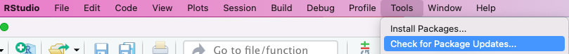

# Background

R's vast package ecosystem provides abundant functionality, but packages can also be a source of frustration. Sometimes packages don't load as expected, and sometimes their dependencies on one another can cause code to break. In this module, we explore some technical details on packages, including how to:

-   check what packages are **attached** during the current R session and those that are **loaded** (technically different)

-   check what packages have been installed (i.e., downloaded), even if they're not attached or loaded in the current session

-   find where installed packages are in your computer

-   remove (detach) packages from the current session

-   unload a package that was loaded via a namespace

-   remove packages from your computer altogether

-   check what packages a package depends on

## Vocabulary: attached to search path vs loaded via a namespace

An "attached" package is one that has been loaded via `library()` and whose functions are accessible without having to use the `::` operator as in `package_name::package_function()`. For example, if dplyr is attached, I can simply write `mutate()`; I don't have to write `dplyr::mutate()`. Packages that are attached are accessible via what R calls the *search path* or *search list*. When a function is used without the double-colon syntax [e.g., `mutate()]`, R looks for a function with that name in the first package on the path, and if it doesn't find it, it looks in the second package on the path, and so on. The order of the search path can be obtained via `searchpaths()`. Packages loaded with `library()` more recently will rank earlier in the search path, which can have consequences for function conflicts.

Packages can also be "loaded via a namespace." This means that the packages have been loaded because the user called the function using the [double-colon operator](https://stat.ethz.ch/R-manual/R-devel/library/base/html/ns-dblcolon.html) (`package_name::package_function()` but has not *attached* the package to the search path via `library()`; because [R Studio sees that the package is used somewhere in the script](https://github.com/rstudio/rstudio/issues/8072), even if the user has not run that code yet; or because the package is needed by the IDE to perform a behind-the-scenes operation. For example, knitr is loaded via a namespace in my current session because I am using R Markdown even though that package does not appear in a script in my current session.

In common usage, I cannot glean any difference between use of a package that has been loaded via namespace versus one that has been installed (e.g., using `install.packages("package_name")` but has not been loaded at all. To use a function from a package that has already been loaded via a namespace, you still must use the double-colon notation of `package_name::package_function()`, as you would a function from a package that has not (yet) been loaded via a namespace.

That a package has been loaded via a namespace may, however, have implications for troubleshooting. For example, if you try to install a package that has already been loaded via a namespace, this dialogue box may appear:


To summarize this section, all attached packages are loaded, but not all loaded packages are attached. We will deduce this relationship using functions from the [sessioninfo](https://r-lib.github.io/sessioninfo/) package below. If a package is attached, we can write the function name by itself without its corresponding package name (mindful of potential conflicts); if not, we must use the double-colon notation, `::`, and write the package as well.

## Vocabulary: package dependencies

Information related to package dependencies appears, for a given package, in the following fields: `Depends`, `Imports`, `and Suggests.` Package dependencies are covered in this work-in-progress [chapter](https://r-pkgs.org/dependencies.html) of the book [R Packages](https://r-pkgs.org).

In brief, sometimes you will notice that the installation of a package causes other packages to be installed. This is because that package `Imports` that package. For any package, this information can be obtained via the `available.packages()` function, described further below. `Suggests` is softer. If a package suggests another package, it won't install that package automatically, but that some features of the package may benefit from functions in that package.

## Resources and references

-   [sessioninfo](https://cran.rstudio.com/web/packages/sessioninfo/readme/README.html): A package for getting information about your packages and other information about the current session, co-authored by some RStudio team members.

-   Chapter13 "Packages" in [An Introduction to R]{.underline}. Technical but precisely written.

    -   Official CRAN link: <https://cran.r-project.org/doc/manuals/r-release/R-intro.pdf>

    -   Direct link to Chapter 13, which discusses packages and namespaces, via an adapted Bookdown interface: <https://colinfay.me/intro-to-r/packages.html>

-   Loaded via a namespace vs attached: <https://stackoverflow.com/questions/14988722/in-r-what-does-loaded-via-a-namespace-and-not-attached-mean>

-   The search path: <https://stat.ethz.ch/R-manual/R-devel/library/base/html/search.html>

-   RStudio automatically loading packages via a namespace: <https://github.com/rstudio/rstudio/issues/8072>

-   Working chapter by Hadley Wickham and Jenny Bryanm on package dependencies: <https://r-pkgs.org/dependencies.html>

# Functions to print information about packages, currently loaded and otherwise

## base R

The following base-R functions provide information about currently loaded or installed packages.

-   `utils::sessionInfo()`: view R version, attached packages, and packages loaded via a namespace. Also includes package version.

-   `base::search()`: shows attached packages. Note this also shows other objects on the search path, including the Global Environment.

-   `base::loadedNamespaces()`: display a list of packages loaded via a namespace.

-   `utils::installed.packages()` returns all installed packages, whether they've been loaded or not.

-   `.libPaths()` returns the folder location in your computer where packages are stored.

-   All available packages in R (whether installed or not) can be obtained via `available.packages()`, which returns a matrix of information about every package available in R, including the fields `Depends`, `Imports`, `LinkingTo`, and `Suggests` These terms are described in the Dependencies chapter of the book [R Packages](https://r-pkgs.org) by Hadley Wickham and Jenny Bryan. If a package `imports` a package, that means it will automatically install that package if the package has not been otherwise installed. This information can then be saved as a dataframe or tibble and explored, demoed below.

These two base-R functions remove (detach) attached packages and unload packages that have been loaded via a namespace. I use the sf package as an example. Note the single colon in `"package:sf"` is [intentional](https://www.rdocumentation.org/packages/base/versions/3.6.2/topics/detach).

## sessioninfo

[sessioninfo](https://r-lib.github.io/sessioninfo/) is a package with functionality similar to that of `utils::sessionInfo()` but has a nicer output and includes more information about packages.

-   `sessioninfo::session_info()` prints session information, including a list of packages, their version, and the date the package was built, and the package source (e.g., CRAN or GitHub).

-   `sessioninfo::package_info()`. [By default](https://cran.r-project.org/web/packages/sessioninfo/sessioninfo.pdf), this function returns a list of packages that have been loaded in the current session, either by attaching them or via a namespace. In contrast with `utils::sessionInfo()`, this function by default does not show base-R functions. Note that at the bottom of the output, the location where packages are stored is shown. You can further specify what types of packages are returned by `sessioninfo::package_info()`:

-   `sessioninfo::package_info(pkgs = "loaded")` returns all loaded packages (default called explicitly).

-   `sessioninfo::package_info(pkgs = "attached")` returns only those packages have been attached to the search path, i.e., via `library()`.

-   `sessioninfo::package_info(pkgs = "installed")` returns all installed packages, whether they've been loaded or not.

# Functions to install, update, and remove packages (base R)

We already know that packages are installed via `install.packages("package_name")`. We can use the dependencies argument to further specify whether or not to also install dependencies. The default behavior is NA, elaborated upon [here](https://www.rdocumentation.org/packages/utils/versions/3.6.2/topics/install.packages).

-   `install.packages("package_name", dependencies = FALSE)` will install the package without its dependencies. This may be useful if you already know that all dependencies for a given package have been installed.

To update packages that are already loaded, use

`update.packages(checkBuilt = T, ask = F)`.

To remove packages from either the search path or a namespace, use:

-   `base::detach("package:sf", unload = TRUE)`. Note if `unload=FALSE`, the package may remain in a namespace.

-   `base::unloadNamespace("package_name")` unloads a namespace.

To remove packages that have been instaslled:

-   `remove.packages("package_name")`

-   To **remove all installed packages** that do not come with R, my suggestion would be to remove the R program altogether via the usual way to remove programs in the operating system (Windows or Mac). You can also follow guidance here: <https://stackoverflow.com/questions/16382647/remove-all-packages-that-do-not-come-with-r>

# Demo of functions

I'm going to load attach two packages, here and ggplot2, and demo some of the above functions. Note that the base R `sessionInfo()` tells us that just one package, here, was attached. Some other packages have been loaded via a namespace.

```{r}
library(here)
library(ggplot2)
sessionInfo()
```

## General session info

`sessioninfo::session_info()`

Now let's get the same information using `sessioninfo::session_info()`. Note the asterisk next to the packages we attached.

```{r}
sessioninfo::session_info()
```

## Explore package info and detach packages

Now let's specify what type of packages we want to see from `sessioninfo::package_info()`

Look at all packages that have been loaded.

```{r}
sessioninfo::package_info("loaded")
```

Look at only those package(s) that have been attached:

```{r}
sessioninfo::package_info("attached")
```

Note that the result of `sessioninfo::package_info("attached")` is a subset of `sessioninfo::package_info("loaded")`, implying that all attached packages are loaded.

I'm not going to print all installed packages, because the list is long, but that would be done by

```{r, eval=FALSE}
sessioninfo::package_info("installed")
```

If we remove here using `detach()`, is it removed from the list of attached packages?

```{r}
base::detach("package:here", unload = TRUE)
sessioninfo::package_info("attached")
```

## Remove a package

Above, we detached the here package from the current session, but it's still available as an installed package. We can check this via `sessioninfo::package_info("installed")`. Rather than print the entire list of installed packages in this demo (long), I'm going to create an object corresponding to the installed packages and then filter only to the here package using dplyr functions.

```{r}
library(tidyverse) #so that the pipe will work
installed_packages_here = sessioninfo::package_info("installed") %>% 
  dplyr::as_tibble() %>% 
  dplyr::filter(package == "here")

installed_packages_here
```

Remove the here package. Note we now get an error when we try to run `here::here()` because the package is nowhere to be found.

```{r, error = TRUE}
remove.packages("here")
here::here()
```

Re-install it.

```{r, include=FALSE, eval=TRUE, echo=FALSE}
#I got an error saying I was trying to use CRAN without a mirror, so I followed
#https://stackoverflow.com/questions/33969024/install-packages-fails-in-knitr-document-trying-to-use-cran-without-setting-a
r = getOption("repos")
r["CRAN"] = "http://cran.us.r-project.org"
options(repos = r)
install.packages("utils")
```

```{r, message = FALSE, warning=FALSE}
install.packages("here")
```

## Examine package dependencies

We can save the information about all available R packages to an object called packages and then convert that object (a matrix) into an easier-to-manage tibble, and then use dplyr functions to filter to one specific package.

We see, for example, that **tidycensus** `Imports` **sf**, among other packages.

```{r}
packages  = utils::available.packages()

library(tidyverse) #so the pipe works
packages_tibble_tidycensus = packages %>% 
  dplyr::as_tibble() %>% 
  dplyr::filter(Package == "tidycensus")

#Just select these two fields.
packages_tibble_tidycensus %>% 
  dplyr::select(Package, Imports)

```

# Use the graphical user interface to manage packages

In R Studio, many (not all, to my knowledge) of the above functions to load packages, examine which packages are loaded or installed, and update packages can be done via the point-and-click interface.

For example, to install packages, we can use the Tools dropdown,

{width="500"}

which leads to

{width="500"}

Checking for package updates can also be done from the Tools dropdown,

{width="500" height="49"}

or from the Packages tab (usually bottom right) of R Studio by clicking the "Update" icon.

This pane shows a list of all packages that have been installed, and those that have been attached have a check mark.

{width="500"}

Packages on the search path (attached) can also be seen from this dropdown. The only package of the below that I loaded explicitly was here.

{width="500"}

This shows the same information as `searchpaths()`.
